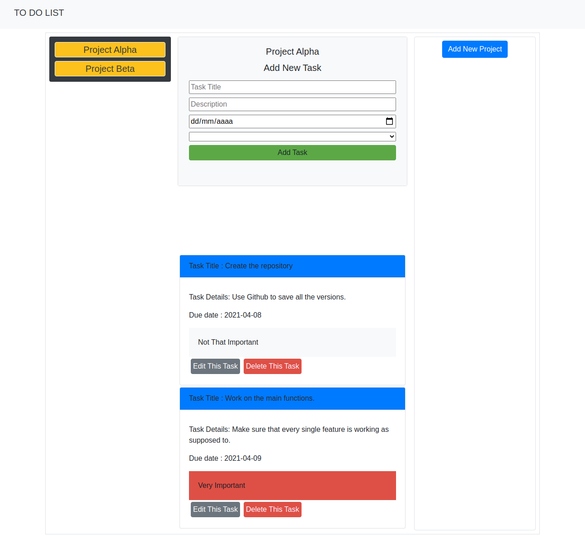

# Javascript TO DO List

>This is a web application created with simple HTML, CSS and JavaScript code for educational purposes. This app will let you create projects and attach a list of tasks to it in order to acomplish the projects. You will be able to edit or delete the task once you add them. The data you insert will be saved in localstorage so it can remain in your computer even if you refresh the webpage.

## Built With

- Bootstrap
- Javascript

## Live Demo

[Live Demo Link](https://rawcdn.githack.com/Jarfsoft/To-Do-List/1639af54b92c8f94e6037bd9a0b14116c10d6897/dist/index.html)

## Getting Started

To get a local copy up and running follow these simple example steps.

### Prerequisites

- A browser
- Text Editor

### Setup

**STEP 1**
In the terminal, Run the following commands.

- `git clone git@github.com:AlanSoto31/Library.git`
- `cd Library-JS`

**STEP 2**

- Then open the `index.html` file using a browser.
- Enjoy the simple library.

## Authors

👤 **Ahmed Amin**

- GitHub: [@AhmedAmin90](https://github.com/AhmedAmin90)
- Twitter: [@AhmedAmin12383](https://twitter.com/AhmedAmin12383)
- LinkedIn: [Ahmed Amin](https://www.linkedin.com/in/web-developer/)

👤 **Juan Raudales**

- GitHub: [@Jarfsoft](https://github.com/Jarfsoft)
- Twitter: [@Jarfsoft](https://twitter.com/Jarfsoft)
- LinkedIn: [Juan Raudales](https://www.linkedin.com/in/juan-raudales-flores-7b0a3b113/)

## 🤝 Contributing

Contributions, issues, and feature requests are welcome!

Feel free to check the [issues page]((https://github.com/AlanSoto31/Library/issues)).

## Show your support

Give a ⭐️ if you like this project!